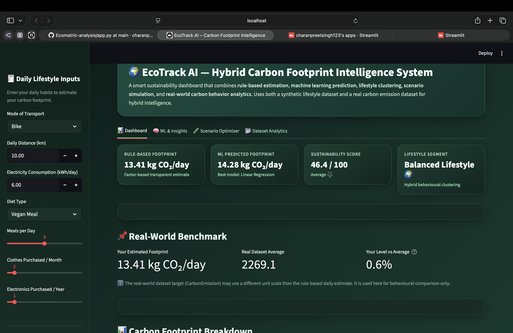
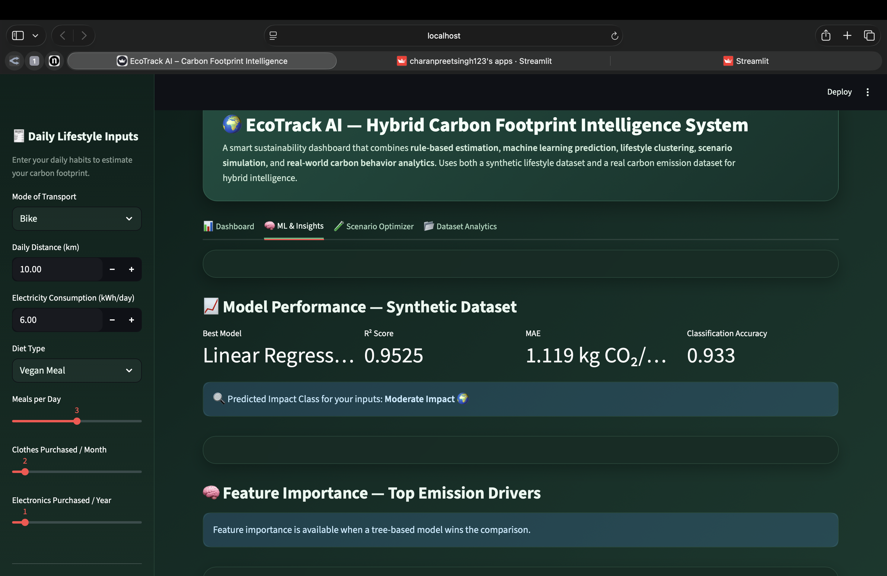
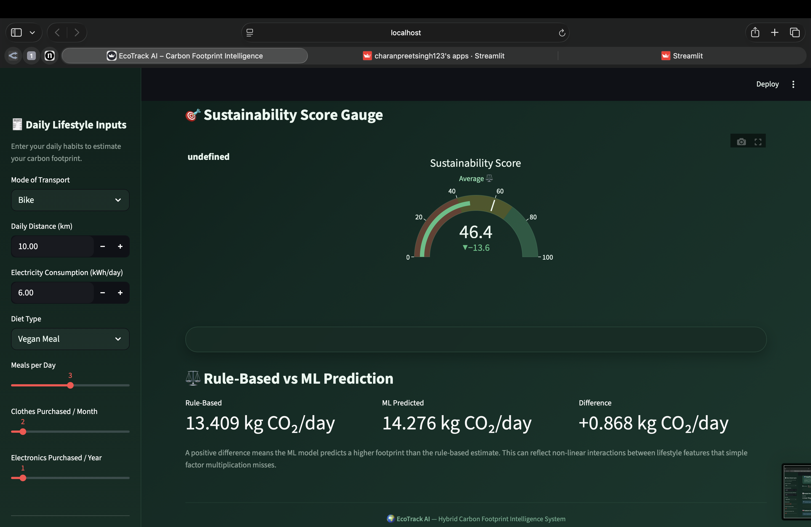
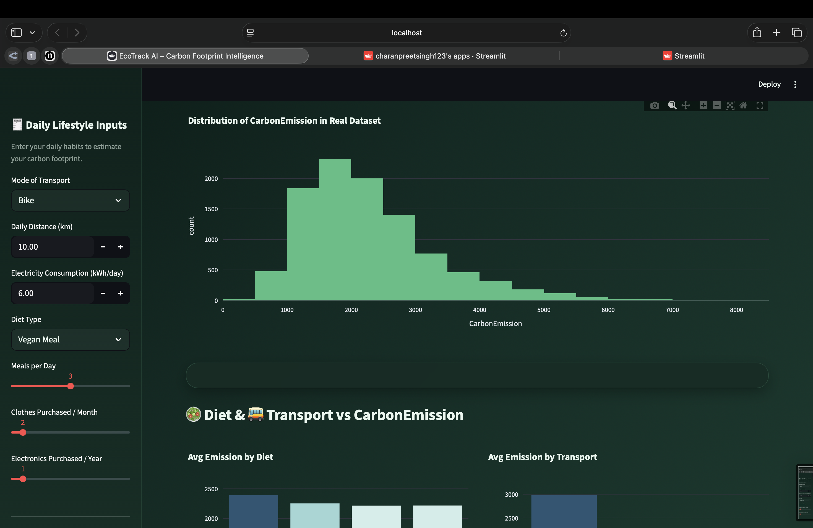
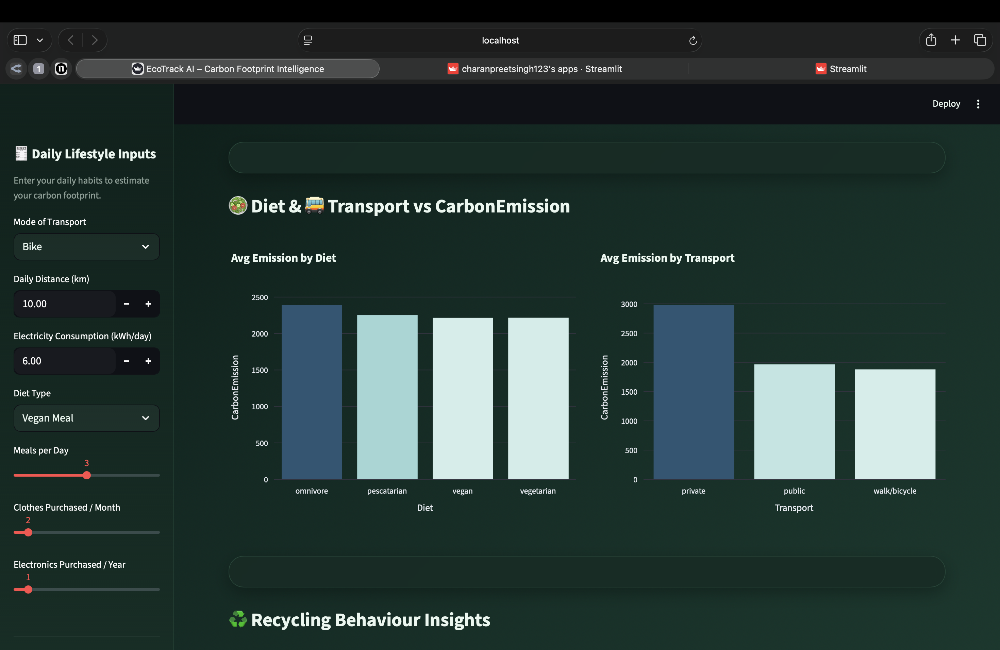

<div align="center">

<br/>


<br/><br/>

# 🌍 EcoTrack AI — Environmental Impact Estimator

### ML-Powered Carbon Footprint Intelligence System

**An interactive web app that estimates your daily carbon footprint using rule-based emission factors and machine learning.**  
Combines data science, lifestyle clustering, scenario simulation, and sustainability analytics into one unified platform.

<br/>

[](https://ecomatric-analysis-ldaxkcdkimlyynempnwohw.streamlit.app)

<br/>

</div>

---

## 📸 Screenshots

<table>
<tr>
<td align="center" width="50%">

### 🏠 Main Dashboard


</td>
<td align="center" width="50%">

### 🧠 ML Insights


</td>
</tr>

<tr>
<td align="center">

### 🎯 Sustainability Score


</td>
<td align="center">

### 📊 Realtime Carbon Distribution


</td>
</tr>

<tr>
<td align="center">

### 🥗 Diet & Travel vs Carbon


</td>
<td align="center">

</td>
</tr>
</table>

---

## 📌 Project Overview

The **EcoTrack AI — Environmental Impact Estimator** helps users understand how daily activities contribute to carbon emissions. It uses a **hybrid approach** — combining transparent rule-based factor calculations with machine learning predictions — to give users both interpretable estimates and data-driven insights.

| Approach | Method |
|---|---|
| **Rule-Based** | Emission factors dataset → category-wise CO₂ calculation |
| **ML Prediction** | Random Forest Regressor trained on synthetic lifestyle data |
| **Clustering** | K-Means to classify users into lifestyle segments |
| **Simulation** | What-if scenario analysis for greener decisions |

---

## ✨ Key Features

| Feature | Description |
|---|---|
| 📊 **Carbon Estimation** | Daily CO₂ estimate across transport, energy, food, and shopping |
| 🤖 **ML Prediction** | Random Forest predicts footprint and compares with rule-based result |
| 🧬 **Lifestyle Segmentation** | K-Means clusters users into Low / Moderate / High impact groups |
| 🧪 **Scenario Simulator** | Simulate greener choices and see the emission difference instantly |
| 💡 **Smart Suggestions** | Personalised sustainability tips based on your highest-emission areas |
| 📈 **Interactive Charts** | Donut, bar, gauge, and feature importance charts via Plotly |

---

## 🧠 Machine Learning Workflow

```
┌─────────────────────────────────────────────────────────────────┐
│                     ML Pipeline Overview                        │
├────────────────────────┬────────────────────────────────────────┤
│  Step                  │  Detail                                │
├────────────────────────┼────────────────────────────────────────┤
│  Dataset               │  synthetic_lifestyles.csv              │
│  Features              │  Transport · Diet · Energy · Shopping  │
│  Preprocessing         │  OneHotEncoder + Passthrough           │
│  Train / Test Split    │  80% train · 20% holdout               │
│  Model                 │  Random Forest Regressor               │
│  Evaluation            │  R² Score · Mean Absolute Error (MAE)  │
│  Clustering            │  K-Means (3 segments)                  │
│  Output                │  Predicted kg CO₂/day + Segment label  │
└────────────────────────┴────────────────────────────────────────┘
```

### Why Random Forest?
- Handles mixed feature types (categorical + numerical) effectively
- Captures non-linear relationships between lifestyle factors
- More robust against overfitting than a single decision tree
- Naturally provides feature importance for explainability

---

## 📊 Datasets

### `emission_factors.csv`
Stores carbon emission factors for each activity and consumption category.

| Field | Description |
|---|---|
| `Category` | Transport · Energy · Food · Shopping |
| `Item` | Specific activity (e.g. Car Petrol, Beef, Electricity) |
| `Unit` | km · kWh · meal · kg · item |
| `EmissionFactor` | kg CO₂ emitted per unit |

### `synthetic_lifestyles.csv`
Used to train the ML model and run K-Means clustering.

| Field | Description |
|---|---|
| `transport_mode` | Mode of daily transport |
| `transport_km_day` | Daily travel distance (km) |
| `electricity_kwh_day` | Daily electricity usage (kWh) |
| `diet_type` | Vegan · Vegetarian · Non-Veg |
| `meals_per_day` | Number of meals per day |
| `clothes_per_month` | Monthly clothing purchases |
| `electronics_per_year` | Annual electronics purchases |
| `beef_kg_day` | Daily beef consumption (kg) |
| `chicken_kg_day` | Daily chicken consumption (kg) |
| `veggies_kg_day` | Daily vegetable consumption (kg) |
| `em_total` | Total daily emission — ML target variable |

---

## 🛠️ Tech Stack

```
┌──────────────────┬───────────────────────────────────────────────┐
│  Layer           │  Tools                                        │
├──────────────────┼───────────────────────────────────────────────┤
│  Framework       │  Streamlit                                    │
│  Language        │  Python                                       │
│  ML & Clustering │  Scikit-learn (Random Forest · K-Means)       │
│  Data Processing │  Pandas · NumPy                               │
│  Visualization   │  Plotly Express · Plotly Graph Objects        │
└──────────────────┴───────────────────────────────────────────────┘
```

---

## 🚀 Getting Started

### Prerequisites
- Python 3.10+
- pip

### Installation

**1. Clone the repository**
```bash
git clone https://github.com/charanpreetSingh123/ecomatric-analysis.git
cd ecomatric-analysis
```

**2. Install dependencies**
```bash
pip install -r requirements.txt
```

**3. Run the app**
```bash
streamlit run app.py
```

**4. Open in browser**
```
http://localhost:8501
```

---

## 📁 Project Structure

```
ecomatric-analysis/
│
├── app.py                        # Main Streamlit application
├── requirements.txt              # Python dependencies
├── emission_factors.csv          # Rule-based emission factor lookup
├── synthetic_lifestyles.csv      # ML training dataset
├── Carbon_Emission.csv           # Real-world benchmarking dataset
│
├── assets/
│   ├── dashboard.png
│   ├── ml_insights.png
│   ├── sustanable_score.png
│   ├── realtime_carbon_distribution.png
│   └── dietandtravel_vs_carbon.png
│
└── README.md
```

---

## 🌱 What This Project Demonstrates

```
✅  Rule-based carbon estimation using emission factor datasets
✅  End-to-end ML pipeline — preprocessing, training, evaluation, prediction
✅  K-Means lifestyle clustering with interpretable segment labels
✅  What-if scenario simulation for greener decision making
✅  Feature importance analysis for model explainability
✅  Interactive dark-themed Streamlit dashboard with Plotly charts
✅  Streamlit Cloud deployment with requirements.txt
```

---

## 🔖 Version

| Version | Description |
|---|---|
| `v1.0.0` | Initial release — rule-based + ML hybrid carbon footprint estimator |

---

## 👤 Author

**Charanpreet Singh**  
B.Tech CSE — CGC University Mohali

[](https://github.com/charanpreetSingh123)
[](https://ecomatric-analysis-ldaxkcdkimlyynempnwohw.streamlit.app)

---

<div align="center">

**Built for Sustainability · Powered by Machine Learning · Deployed on Streamlit Cloud**

<br/>

*Found this useful? Give it a ⭐ on GitHub!*

</div>
